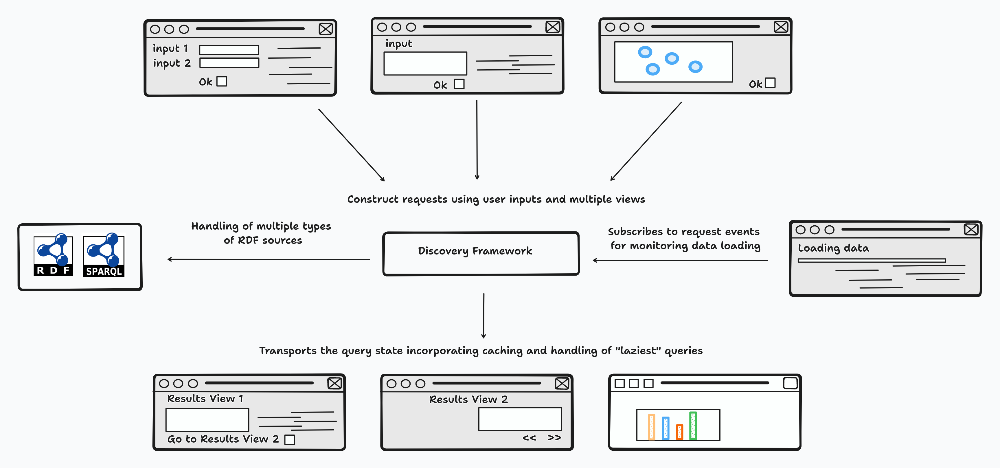

# Summary

Linked data is increasingly available on the web and has been widely adopted by the bioinformatics community. 
However, it is not common to find APIs that enable the direct use of semantic information in web interfaces. 
This often leads web application designers to incorporate this information into relational databases, 
as they can benefit from the query builder and object-relational mapping features that are widely used in this community.

We have developed Discovery, a free software library designed to easily build intuitive and interactive user interfaces 
to exploit RDF data in graphical form. The API provides a dedicated query language to create and maintain complex queries 
to be used in a client or server side web development environment. We used Discovery to implement functionality in web decision 
support applications within the MetaboHUB consortium (French national Metabolomics and Fluxomics infrastructure) : 
FORUM[@delmas_forum_2021] (Metabolism Knowledge Network Portal) and PeakForest[@paulhe_peakforest_2022] (The Metabolomics spectral database web portal).

# Statement of need

Nowaday, the use of semantic web technologies into bioinformatics has become ubiquitous across all domains of life sciences[@wu_semantic_2014]. 
Many bioinformatics resources is now organized according to the FAIR (Findable, Accessible, Interoperable, and Reusable) principles[@wilkinson_fair_2016], enabling efficient management and reuse of data in both research and industrial settings. This implementation was made possible by the standardized languages and protocols defined by the World [Wide Web Consortium (W3C)](https://www.w3.org/) such as the [Resource Description Framework (RDF)](https://www.w3.org/RDF/) which provides a versatile framework for representing data and knowledge in a machine-readable format and the [SPARQL query language](https://www.w3.org/TR/sparql11-query/) to exploit these data known as knowledge graphs.

Bioinformatics communities are encouraged to develop ontologies that adhere to the principles of the Basic Formal Ontology[@BFO:2022] and the Open Biological and Biomedical Ontology Foundry[@BFO:2022]. These ontologies aim to structure the modelling of knowledge in a common conceptual framework and allow the reuse of existing ontologies, favouring collaboration between different research communities.
The datasets, now structured, use controlled vocabularies and taxonomies to use unambiguous standard terms.

Effective tools (BioPortal[@noy_bioportal_2009], EMBL-EBI Ontology Lookup Service[@cote_ontology_2006] and AgroPortal[@jonquet_agroportal_2018]) exist to access ontologies and datasets. In addition, these resources can be imported into RDF data store, also known as triplet store, to be exploited using the SPARQL query language. In conclusion, semantic web technologies have greatly facilitated the integration and exploitation of bioinformatics data, allowing the efficient management of large and complex datasets.

[MetaboHUB](https://www.metabohub.fr/home.html) is a French national infrastructure dedicated to research in metabolomics and fluxomics, with the aim of providing an integrated platform for the study of metabolic pathways and networks. This initiative brings together a wide range of academic and industrial partners, including experts in analytical chemistry and bioinformatics, to develop cutting-edge technologies and methodologies for metabolomics research. One of the key objectives of MetaboHUB is to ensure data and software interoperability within the consortium. In this context, our working group "Creating FAIR resources for knowledge mining" aims to organize data and metadata in RDF format, as well as to structure consortium software products into web components, allowing for better reuse and integration of resources within the scientific community.
Presently, this has led to the establishment of a specialized infrastructure aimed at harnessing knowledge bases. Within these resources, we provide the metabolic community access to a knowledge graph that delineates connections between chemical compounds and the scientific literature[@delmas_forum_2021]. Additionally, we have introduced an expanded knowledge graph using a Bayesian framework, encompassing overlooked metabolites lacking annotated literature[@delmas_forum_2023].

# Overview of the General Design

The query generator relies on the manipulation of immutable data structures, a fundamental tenet of functional programming. Once created, these structures persist unaltered throughout the application's execution, providing advantages such as improved code clarity and the avoidance of unintended side effects. Developers can effortlessly construct intricate SPARQL queries by combining merging immutable query fragments. This immutability is crucial for reducing bugs linked to unforeseen alterations in object state, thereby simplifying long-term code maintenance.

The Discovery API utilizes the [Scala.js](http://www.scala-js.org/) compiler to ensure compatibility with established JavaScript libraries, a critical aspect in the realm of web development. This functionality facilitates the smooth assimilation of widely-used JavaScript libraries, allowing for tasks like DOM manipulation and other UI-related functions within web components.

Furthermore, [Scala.js](http://www.scala-js.org/) produces optimized JavaScript code, a critical consideration in web applications where responsiveness and a seamless user interface are imperative. The synergy between functional programming in Scala and transpilation through [Scala.js](http://www.scala-js.org/) facilitates the manipulation of a high-level API, enabling developers to focus exclusively on the concepts dedicated to the construction of a query in the end.

Discovery incorporates a Query Builder (QB) to streamline the construction and generation of SPARQL queries. The queries are crafted iteratively, facilitated by a dedicated Query Language (DSL). This module is paired with a second module enabling the selection of the data source, be it a SPARQL endpoint or an RDF resource.

# Key Features

## Elementary Building Blocks
<!-- Update query par elements de construction -->
A distinctive quality of the QB module is the categorization of construction elements, such as resources and qualifiers. Immutability is deliberately imposed, fortifying the security of the development process and simplifying debugging. This intentional structure promotes stability in query creation, a critical factor for precise and error-free development.

## Data Flow Management and Pagination

Addressing scalability concerns, the QB module incorporates intelligent pagination, particularly beneficial when crafting result lists with a significant number of elements. This optimization ensures the efficiency of queries and responses, enhancing the overall performance.

## Request Transport via String Serialization in a Web Architecture

Tailored for web development, Discovery's Query Builder introduces features such as string transport, simplifying component communication. Additionally, developers can enhance user queries by embedding metadata, providing contextual information within graphical representations for a more enriched user experience.

## Event Management for Dialog Box Notifications and User Interactions

## Asynchronous Results and Error Handling

The QB module places a premium on asynchronous result reception, ensuring the responsiveness of web applications. Developers can subscribe to events, staying abreast of specific interactions or changes and fostering a dynamic and interactive web development environment.

In essence, Discovery, as the Query Builder, serves as a pivotal guide in the intricate realm of SPARQL query generation. From streamlined configuration to categorization, scalability, and web-specific functionalities, this module empowers developers to navigate the complexities of web-based RDF data manipulation with precision and efficiency.

# Acknowledgements

***

# References

